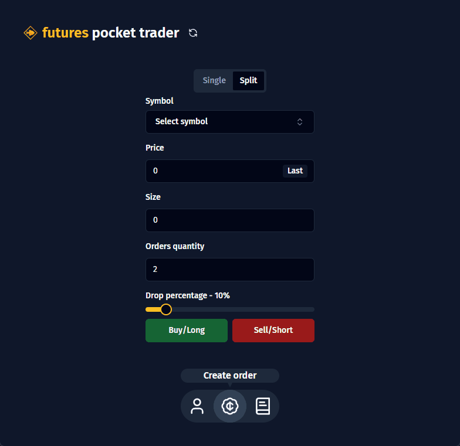
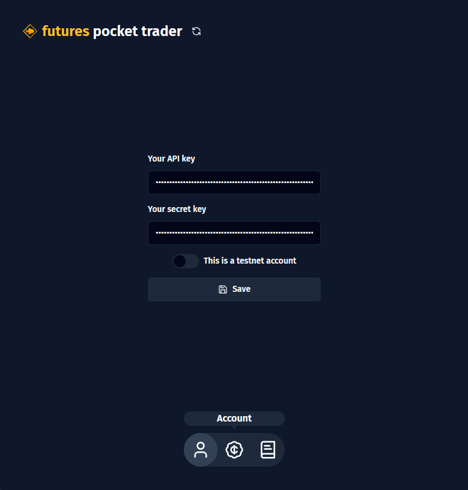
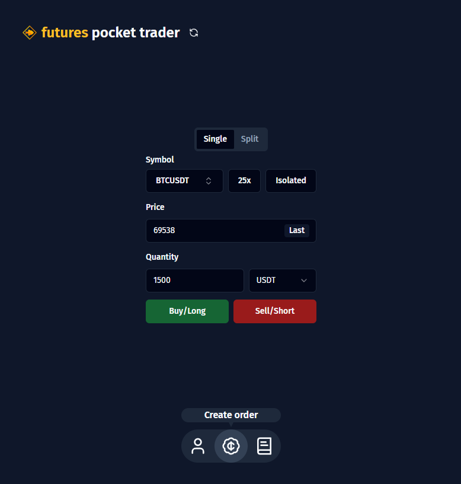
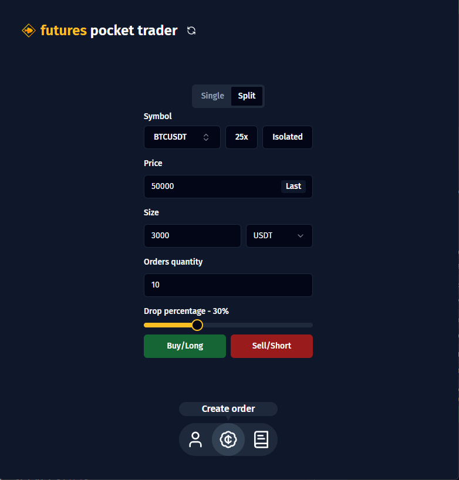
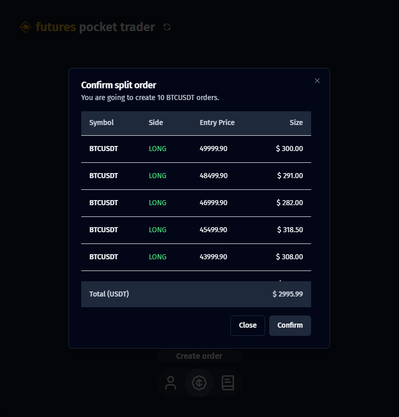
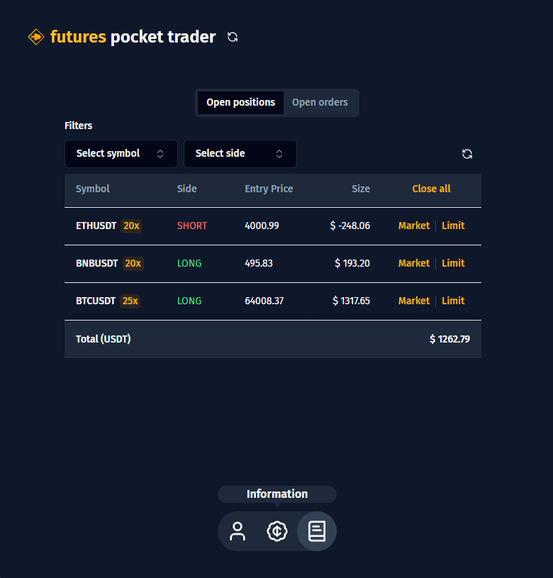
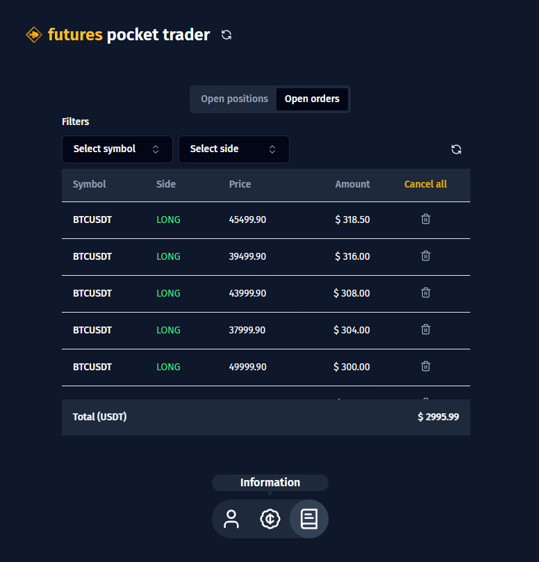

# 🪙 Futures Pocket Trader</h1>

  
  
  
  
  

## 📑 About

A desktop application built with Electron that simplifies creating new orders, viewing information about positions and orders, and the ability to create multiple orders at different prices. All this using Binance Future's API!

Feel free to open new issues and suggest new features. This project is open-source and its main objective is to provide a simplified interface for traders to carry out their operations in the futures market.

<a href="https://github.com/lorenzoa7/futures-pocket-trader/releases/latest">Download latest version (click on the .exe)</a>

## 🌟 Features

- Built using Electron
- Possibility to connect to a testnet account
- Create single order with few steps
- Create up to 20 orders at once, defining the total size and percentage of price drop that will be divided by the number of orders
- View your list of open positions, being able to filter by symbol and close them in a simple way
- View your list of open orders, being able to filter by symbol and cancel them simply

## 🤓 How to use

### 1. Set your Binance's API key and Secret key

Firstly, in the "Account" page, you must enter your API key and your Binance secret key and hit the save button. If you want, you can activate the option "This is a testnet account" if you are using a testnet network account (for testing only).

This application needs the keys to work, as the connection to Binance can only be made with them. Your keys are saved locally on your machine, so you can feel safe entering them into the app.

### 2. Create a single order

In the "Create order" page, you will find yourself in the "Single" section, to create just one order. Firstly, you must define the symbol, and you can also change its leverage and margin type. Then, you define the price of the currency (you can click the "Last" button to reset to the last market value) and the quantity, which can be in any of the currencies in the pair. Finally, you choose whether to buy/long or sell/short.

In the example below, we will create a BTCUSDT order, with leverage at 25x and with the isolated margin type. The order will be created at the price of 69538 USDT, where we will buy 1500 USDT.

### 3. Create a split order

In the "Create order" page, you can go to the "Split" section, to create multiple orders. Same as the previous section, you define the symbol and the price you will buy. However, this time, you will define the total order size, which will be divided by the number of orders you also define. Furthermore, you can define a price drop percentage, that is, the orders created will vary from the defined price to their value with the decreased percentage.

In the example below, we set the price to be 50,000 USDT and the total size to be 3,000 USDT. So, we define that 10 orders will be created, with a drop percentage of 30%. In this case, 10 orders will be created, of 300 USDT each (3,000 divided by 10), with the first order created at price 50,000, the second 3% below that (48,500) and so on until reaching 30% below the last order (37,500).

A summary of the orders will then appear on your screen for you to review and confirm. Tip: if you just want to create multiple orders at the defined price, without variations, just set the drop percentage to 0%.

### 4. Open positions information

In the "Information" page, you will find yourself in the "Open positions" section. Here, you can view all your open positions, their most relevant information and the total positioned in USDT. You can also filter by symbol and by side (LONG or SHORT), which will also update the total positioned information (for example, you can view the total you have positioned only in LONG).

Additionally, you can also close all positions at market price or close a single position at both market and limit.

### 5. Open orders information

In the "Information" page, you can go to "Open orders" section. Here, you can view all your open orders, their most relevant information and the total USDT. You can also filter by symbol and by side (LONG or SHORT), which will also update the total information (for example, you can view the total, in USDT, of BTCUSDT orders).

Additionally, you can also cancel all orders or close a single order.

## 🎮 Running Locally

### 1. Clone this repository:
<pre>
  <code>
    git clone https://github.com/lorenzoa7/futures-pocket-trader.git
  </code>
</pre>

<h3>2. Install the dependencies:</h3>
<pre>
  <code>
    npm install
  </code>
</pre>

<h3>3. Start the server</h3>
<pre>
  <code>
    npm run dev
  </code>
</pre>

## 🔧 Credits
<a href="https://github.com/lorenzoa7" style='display: flex; flex-direction: column; align-items: center;'>
     
    
        <b>Lorenzo Aceti</b>
    
</a>

## 📌 License
<b>This project is under MIT license.</b>
